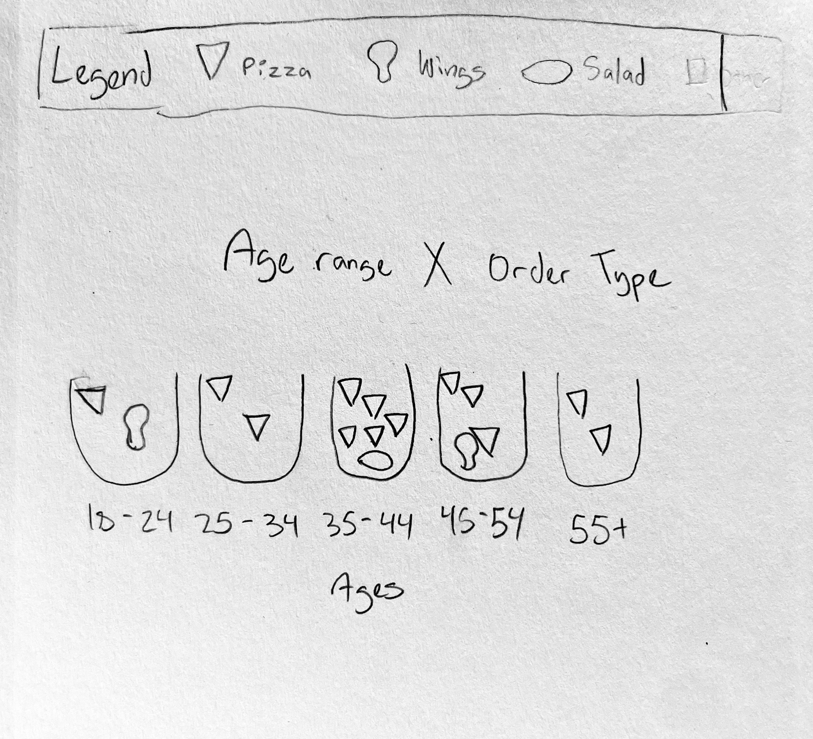
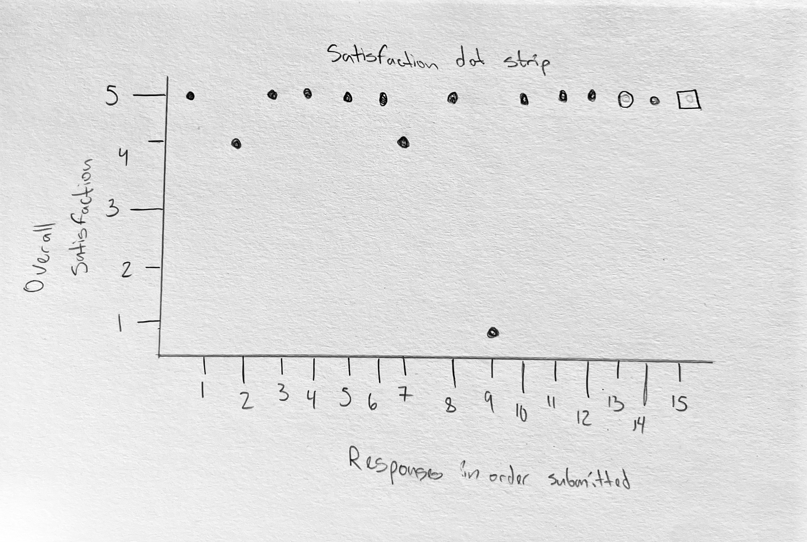
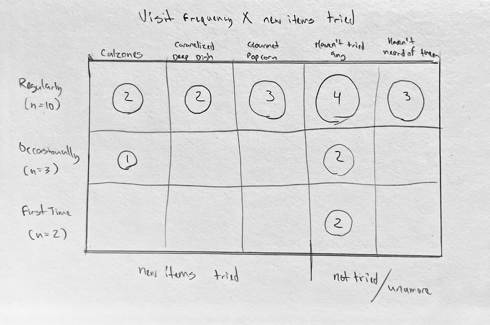
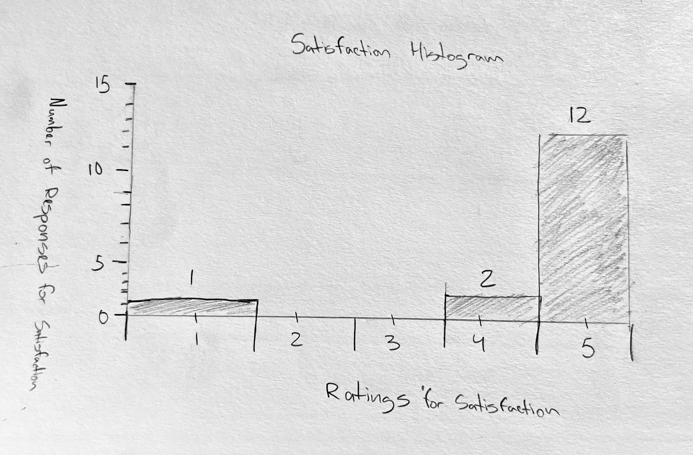
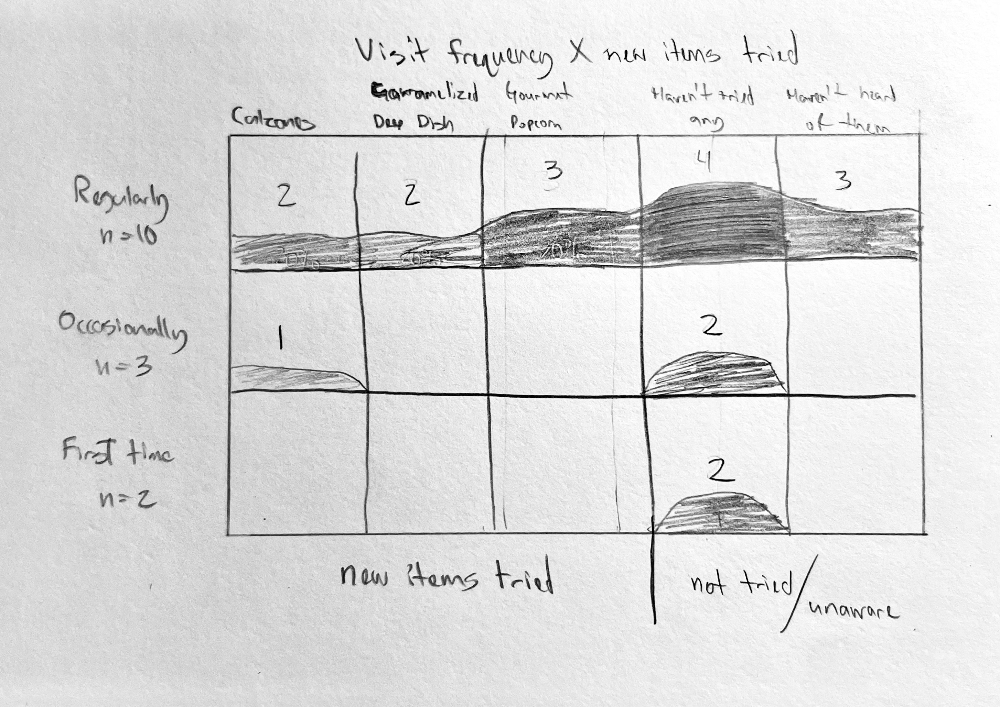

# CS 424 Assignment 1 - Collecting data and sketching visualizations

## Task 1: Observation and data collection plan

### Original plan: Cor Coffee

As a CS+Design student with no prior background in data science or data visualization, this was my first experience designing a data collection process. Within the first week, with limited time to settle on an idea, I adopted a project close to one of the examples offered in the assignment: observing occupancy and activity at Cor Coffee, a café in UIC's Newman Center. One observation was a 10–15 minute visit during which I recorded a snapshot of the room: total people present, people in line, people working versus socializing, open seats, and a 1–3 noise rating, across whatever windows my class schedule allowed.

Because this approach came directly from the assignment's own example list, I assumed it would be relatively safe to execute. It was not. Taking a headcount in a dim room meant repeatedly looking around at people I didn't know, which felt invasive and uncomfortable to do regularly. The "people in line" attribute turned out to be ambiguous in a way I hadn't considered until I tried to record it: did it mean a running accumulation, a peak count, or an average over the visit? Noise level was the clearest failure, my professor flagged early on that a self-reported 1–3 scale would be heavily biased by where I happened to be sitting and that I had no real measurement equipment, which raised the question of whether a phone decibel app could substitute, and if so, with what limitations I'd need to test and document myself. Beyond the attributes themselves, the larger problem was logistical. Being physically present at Cor Coffee multiple times a day, several days a week, was difficult to sustain on top of a commuter schedule and a full course load.

### Pivot: Beggars Pizza customer survey

About a week after the assignment was released, while working a shift at Beggars Pizza in Lansing (my hometown), I thought of an alternative. Since I already design marketing materials for Beggars, I could create my own poster and box-topper with a QR-linked survey, placed at two locations, Lansing and the West Loop in Chicago, and use the two-location split as a built-in point of comparison. With two weeks left before the deadline, I believed this was enough time to design, get approval for, print, and post the materials at both locations. That assumption turned out to be overly ambitious, which Task 2 and Task 3 discuss in more detail.

### Proposed domain questions (initial)

As stated in my pivot proposal to Professor Miranda:
1. Which location has higher customer satisfaction overall?
2. What atmosphere qualities do customers value most at each location?
3. Are there differences in ordering habits between urban (West Loop) and suburban (Lansing) customers?
4. Does age demographic correlate with what items are ordered, how often, and at which location?
5. Which menu items are most popular overall, and does popularity differ by location?
6. How aware are customers of newer menu items, and have they tried them?

### Collection process

One observation = one submitted survey response, collected via a QR code on an in-store poster and a box-topper stapled to every pizza box, so every customer who ordered a pizza would see it. Responses fed directly into a connected Google Sheet. I estimated volume using Lansing's typical ticket counts (~300 tickets/weekday, 500+/weekend day, ~5,000 tickets over two weeks) and a conservative 5% voluntary response rate, projecting roughly 250 observations. Collection was planned across both locations to capture the two-dimension variation the assignment asks for: location (urban vs. suburban) and time (across different days/weeks).

**What this plan could fail to capture:** customers who don't notice or bother with a QR code, and non-English speakers. Respondents are self-selected, so the data does not represent the customer base fairly.

### Division of labor 

I completed this assignment individually, so all data collection, poster/box-topper design, and survey administration were done by me alone, in coordination with Beggars Pizza staff and corporate contacts (detailed further in Task 7).

### Data dictionary

| Attribute | Type | Description | Example |
|---|---|---|---|
| timestamp | Temporal | Auto-captured date/time of submission | 9/26/2026 18:38:07 |
| location | Categorical | Which Beggars location the respondent is at | Lansing |
| overall_satisfaction | Quantitative (1-5) | Overall satisfaction rating | 5 |
| food_quality | Quantitative (1-5) | Food quality rating | 4 |
| service | Quantitative (1-5) | Service rating | 5 |
| atmosphere | Quantitative (1-5) | Atmosphere rating | 5 |
| order | Categorical (free text) | What the customer ordered | "Small Turkey Sausage Pizza" |
| visit_frequency | Categorical | How often they visit | Regularly |
| tried_new_items | Categorical (multi-select) | Awareness/trial of newer menu items | "Calzones, Gourmet Popcorn" |
| age_range | Categorical | Respondent's age bracket | 35-44 |
| improvement_comment | Categorical (free text, optional) | Open-ended suggestion | "Free delivery please" |

## Task 2: Pilot and data collection

My pilot was the first 10 responses, all collected over one weekend right after the poster and box-topper went up at Lansing. That early turnout was a good sign. The survey questions held up fine, responses came in clean and consistent, and nothing about the attributes needed fixing.

The real problem showed up after the pilot, not in it. Box-toppers ran out that first weekend, and no new ones got restocked at Lansing or ever showed up at West Loop, despite Beggars' corporate contact saying more were coming. Since the box-topper was stapled to every pizza box and guaranteed visibility, response volume basically stopped once they ran out. The last five responses in my dataset trickled in slowly, probably from the poster alone, which doesn't get seen nearly as reliably as something physically attached to someone's order.

So the actual lesson here wasn't about my collection method. The questions, the QR code, the one-observation-per-submission structure, all of that worked. What failed was something outside my control: depending on a third party's printing and distribution timeline, which fell through without warning. I didn't push Beggars for more materials once the supply ran out. They had already printed everything for free as a favor, and I didn't want to pressure a business contact over a class assignment.

The final dataset is in [`survey-responses.csv`](survey-responses.csv).

## Task 3: Data description and domain questions

**The dataset.** I collected 15 survey responses between Sept 21 and Oct 5, 2026, through a QR code on in-store posters and pizza-box toppers. Thirteen responses are from Lansing, one is from West Loop, and one has no location. Respondents skew toward regulars (10 of 15) and ages 35-44 (6 of 15). Satisfaction is clustered at the top (mean 4.6), with one 1/1/1/1 response whose comment ("Fire justin") reads as a joke aimed at me rather than real feedback. I kept it in the dataset but flag it as likely non-genuine. The sample is also self-selected, so it probably over-represents happy, engaged customers. Two attributes were hard to record: the free-text order field, which I had to bucket into pizza, wings, salad and other, and the new-item question, where one respondent checked both "haven't tried any" and "haven't heard of them."

**From observation to data.** A survey response only captures what someone chose to report about a visit. A 1-5 rating flattens the experience, and bucketing orders threw away detail like crust, toppings and size. The biggest loss is invisible: customers who ordered but never scanned the code aren't in the data at all. Treating one response as one row also hides group orders, since a family order is one row with one age range.

**Domain questions.** My original questions were mostly about location, which 15 responses (13 from Lansing) can't support. The revised ones use the variation I actually have:

1. **Does visit frequency relate to which newer items people have tried or heard of?** Attributes: visit frequency, new items tried. This replaces my original awareness question. Among regulars, 6 of 10 haven't tried a new item or haven't heard of them, which suggests a marketing gap.
2. **Does age range relate to what people order?** Attributes: age range, bucketed order. I kept this from the original plan, dropping the location part.
3. **What share of respondents have tried, not tried, or not heard of the new items?** Attributes: new items tried. It's the simplest summary of how far the new items have reached.
4. **What distinguishes the one low-rated response from the rest?** Attributes: satisfaction ratings, comment, timestamp. Since nearly everyone answered 5, the one outlier is the only variation in satisfaction.

I dropped the location comparison and the atmosphere question because one West Loop response isn't a comparison, and atmosphere barely varied.

---

## Task 4: Task abstractions

| Domain question | Action | Target |
|---|---|---|
| 1. Visit frequency vs. new items tried | Discover | Dependency between two categorical attributes |
| 2. Age range vs. order type | Compare | Order categories across age groups |
| 3. Share who tried / not tried / haven't heard | Summarize | Distribution across categories |
| 4. The low-rated response | Identify | An outlier relative to the other ratings |

Each mapping describes what someone needs to do, not a chart type. For question 1, I first wrote "correlate," but that isn't a standard action, so I split it into an action (discover) and a target (a dependency between frequency and trial). Question 2 is a comparison because the user wants to see whether groups differ, not read exact values. Question 3 is a summary because the aim is the overall picture across categories. Question 4 is identifying an outlier because the point is spotting the exception, not describing the whole distribution. Doing this changed how I saw the questions. Two of the four, discover and compare, depend on group sizes being comparable, which my data doesn't satisfy, and that pointed me toward proportions in my refined sketches.

## Task 5: Visualization sketches

**Sketch 1: Age × order type**

I wanted to know whether age influences what someone orders at Beggars, and whether there's a broader trend between age and ordering. I made one bracket per age range and drew an icon for each item type (pizza, wings, salad), repeating the icon for each item ordered. The 35-44 bracket has the most orders (5 pizzas and 1 salad), followed by 45-54 (3 pizzas and 1 wing order). Most respondents are 35-54, which may reflect who answers a QR survey as much as who orders, so Beggars' actual customer base and pricing history would be worth checking. Pizza dominates every bracket, so age doesn't visibly change what people order at this sample size. The brackets are different sizes, so raw counts aren't directly comparable across them.

**Sketch 2: Satisfaction dot strip**

This is a basic dot plot showing overall satisfaction for every response in submission order. Vertical position is the rating, and shape marks location: filled dots for Lansing, open dots for West Loop, and a square where no location was given. It's not very insightful, but it gives a quick picture of satisfaction and exposes the single outlier rating of 1. It's also heavily biased, since nearly everyone gave a 5 and the people who scan a QR code are mostly happy customers. Dots at the same rating stack on top of each other, so you can't tell how many there are.

**Sketch 3: Visit frequency × new items tried**

This grid crosses visit frequency (rows) with each new menu item and the "haven't tried" and "haven't heard" answers (columns), with dot size showing the count. It's the most insightful of my three because it points at how well new items are marketed: 6 of the 10 regulars either haven't tried a new item or haven't heard of them. The question is multi-select, so one person can appear in several columns, and the dots count answers rather than separate people. It also shows counts rather than proportions, so regulars (n=10) dominate the picture. With a larger dataset, this could show which items corporate should promote to regular customers.

## Refined sketches

After comparing my three initial sketches, I refined the two with the clearest problems. The age-by-order pictogram stayed as is.

### Refined sketch 1: Satisfaction histogram

My dot strip showed every response as its own dot, which works for 15 responses but would be unreadable with thousands of tickets. I redrew it as a histogram: ratings run along the bottom and the height of each stack shows how many responses gave that score. This answers the same question as before, how satisfied respondents are and whether any response stands out, but it scales, and it makes the pile-up at 5 and the single outlier at 1 easy to compare across the chart. Position and length on a common scale are doing the work. A viewer should learn how concentrated satisfaction is at the top and how rare a low score is. 

### Refined sketch 2: Visit frequency × new items tried

My first grid used dot size for counts, which made regulars (n=10) look more important than occasional visitors (n=3) or first-timers (n=2) just because there were more of them. In the refinement, each square is filled like a container of liquid: the more respondents in that square, the larger the wave, and I also shade the wave darker as the number rises, so the two channels reinforce each other. Rows are visit frequency and columns are the new-item categories. A viewer should be able to see at a glance which groups have or haven't tried the newer items, and where the awareness gap is largest. 

---

## Task 6: Summarizing

I explored three directions: a pictogram of items ordered by age (icons repeated per item), a dot plot of individual satisfaction ratings, and a grid crossing two categorical attributes. My refinements pushed the second toward a histogram that scales and the third toward a design where group size doesn't dominate. The pictogram is the most readable for a general audience but only shows counts, and with groups of different sizes it can't be compared fairly. The dot plot is the simplest and exposed the one outlier, but it stops working as the data grows. The grid is the most expressive, since it relates two attributes and shows which items reached which customers, but it is the hardest to read, and its small rows are fragile with few responses.

Sketching changed my questions more than I expected. I started out asking what was popular and ended up asking who answered and what the data is missing. Satisfaction turned out to have almost no variation, so the histogram's value is mostly in showing the outlier, and the grid made the awareness gap among regulars the most interesting finding. Knowing the data was self-selected and small shaped my designs: I stopped trying to compare Lansing with West Loop, I avoided charts that would hide group sizes, and I labeled small rows with their n.

My sketches mostly use dots, icons, position and shade, so the range of techniques is narrower than I'd like. I never sketched anything with the timestamp, which would have shown response volume dropping off once the box-toppers ran out. If I collected again, I would get more West Loop responses, and replace the free-text order field with checkboxes to avoid the bucketing step.

---

## Task 7: Collaboration process

I completed this assignment individually, so collaboration here means coordination with people outside the course rather than teammates. I emailed Professor Miranda directly when deciding whether to pivot from Cor Coffee and again when I needed an extension. At the Lansing location, I spoke with my managers in person to get approval for posting the materials. With Beggars' corporate contacts, Amanda and Michelle, I communicated over Telegram and by phone, including a call with Michelle to follow up on the printed materials.

What worked well: in-person conversations with my Lansing managers were fast and easy since I already work there. What was harder: coordinating with corporate was slower and less predictable, since printing and distribution depended on their internal timeline, not mine, and I had no way to speed that up once it stalled.

